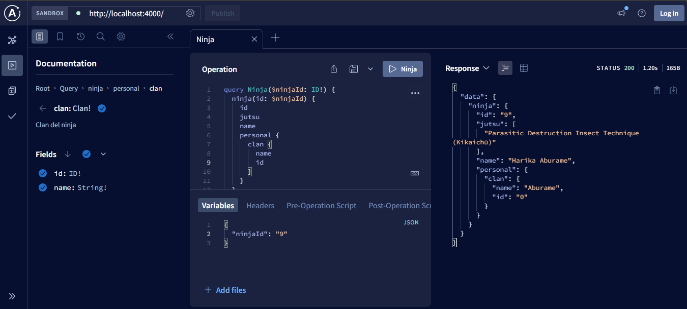

# Proyecto Naruto GraphQL

Este es un proyecto básico de GraphQL que implementa un servidor utilizando [Apollo Server](https://www.apollographql.com/docs/apollo-server/).  
El objetivo es proporcionar una APIs GraphQL para obtener información sobre Ninjas del anime Naruto.

## Requisitos

- Node.js v22 o superior
- npm v10 o superior

## Instalación

1. Clona el repositorio:
    ```sh
    git clone https://github.com/chokecoDev/naruto-graphql.git
    ```
2. Navega al directorio del proyecto:
    ```sh
    cd naruto-graphql
    ```
3. Instala las dependencias:
    ```sh
    npm install
    ```

## Uso

Para iniciar el servidor de desarrollo, ejecuta:

```sh
npm run dev
```


